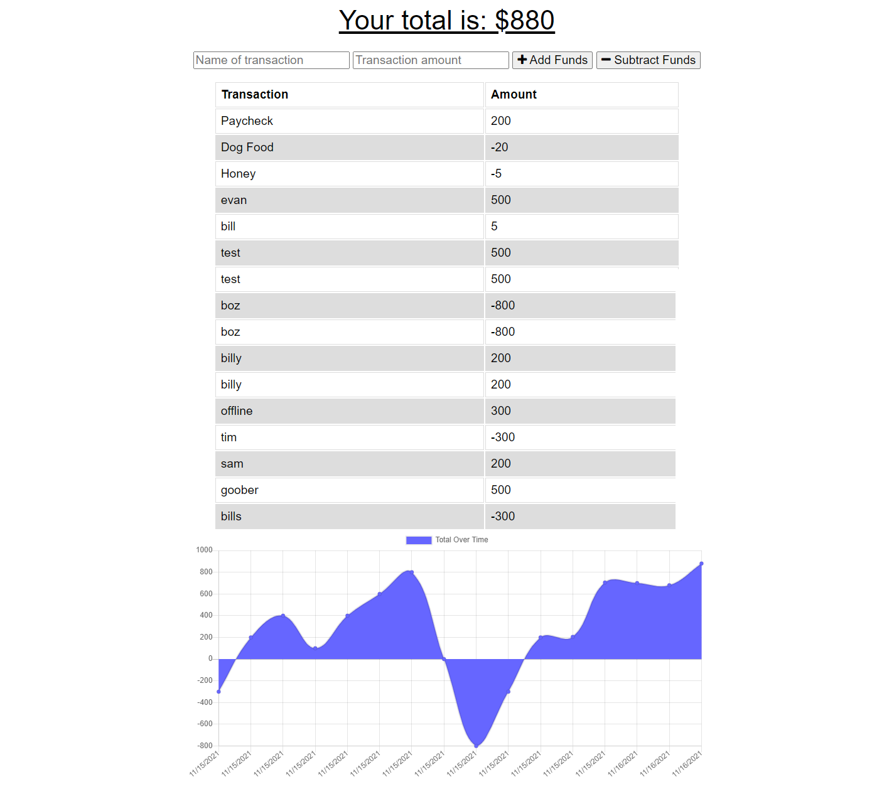

# Budget Tracker PWA

## Description

This budget tracker keeps track of inflowing and outflowing cash with a MongoDB server and offline tracking capabilities.

## Table of Contents
  * [Installation](#installation)
  * [Usage](#usage)
  * [Questions](#questions)
  * [License](#license)
    
    
## Installation
    
  _Follow these steps to install this application:_

  Click install in URL Finder.
      
## Usage

  _Instructions for use:_

  Add and subtract purchases via the GUI
  
  
        
  [Link to deployed project](https://agile-gorge-03257.herokuapp.com/)  
## Questions
      
  If you have any questions, please reach out via Github or my email.
  
  _Contact Info:_

  GitHub: [alextheshire](https://github.com/alextheshire)

  Email: [aalexbberes@gmail.com](mailto:aalexbberes@gmail.com)
    
## License

      
  _This application has the MIT License._
      
  For more information please view the [license description](https://choosealicense.com/licenses/MIT).
  
  
